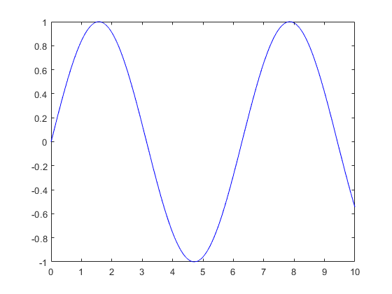
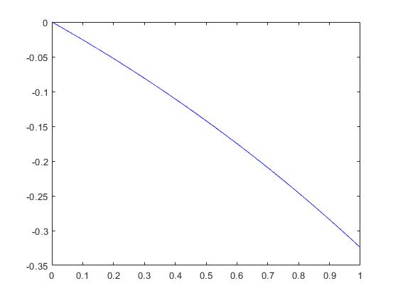

# Qausi-Splins-Super-Convergence

Dans ce projet, j'ai travaillé sur la notion de super-convergence basée sur les méthodes de quasi-splines, qui sont des techniques de modélisation numérique visant à générer des solutions approximatives de haute qualité pour des problèmes d'interpolation ou d'approximation dans des espaces multidimensionnels. Elles sont largement utilisées en géométrie informatique, en simulation numérique et en analyse des éléments finis. Les quasi-splines, comme leur nom l'indique, sont une extension des splines classiques, mais elles introduisent certaines flexibilités et généralisations pour mieux s'adapter à des données complexes ou irrégulières.

### Définition des quasi-splines
Une fois que les points de contrôle et les fonctions de base sont définis, la quasi-spline est construite comme une combinaison linéaire des fonctions de base :

$$
 f(x) = \sum_{i=1}^{n} c_i \cdot \phi_i(x) 
$$

où $\phi_i(x)$ est la i-ème fonction de base et $c_{i}$ est un coefficient à déterminer. Les coefficients $c_{i}$ sont ajustés pour minimiser l'erreur entre la quasi-spline et la fonction à modéliser.

### B-splines de degré 0 (fonctions indicatrices)
Les B-splines de degré 0 sont simplement des fonctions indicatrices qui prennent la valeur 1 sur un intervalle donné et 0 ailleurs. Si $t_i$ sont les nœuds, la B-spline de degré 0, notée $N_{i,0}(x)$, est définie comme :

$$
N_{i,0}(x) = 
\begin{cases} 
1, & \text{si } t_i \leq x < t_{i+1}, \\
0, & \text{sinon}.
\end{cases}
$$

### B-splines de degré 1 et plus (définition récursive)
Pour les B-splines de degré $p > 0$, on utilise la récurrence de Cox-de Boor :

$$ 
N_{i,p}(x) = \frac{x - t_i}{t_{i+p} - t_i} N_{i,p-1}(x) + \frac{t_{i+p+1} - x}{t_{i+p+1} - t_{i+1}} N_{i+1,p-1}(x),
$$

où $N_{i,p-1}(x)$ et $N_{i+1,p-1}(x)$ sont les B-splines de degré $p-1$.

Cette formule combine deux B-splines de degré inférieur pour construire une B-spline de degré supérieur.

### Exemples 
J'ai donné deux exemples de fonctions pour la validation de la méthode que j'ai implémentée avec les B-splines de degré 5.
| Fonction | L2_Error | Linf_Error |
|----------|----------|------------|
| $sin(x)$    | $8.04 \times 10^{-13}$    | $5.80 \times 10^{-14}$      |
| $\frac{-1}{2} \left( \exp\left(\frac{x}{2}\right) - 1 \right)$ |  $5.70 \times 10^{-15}$   | $1.44 \times 10^{-15}$      |

Nous présentons les figures associées à chaque fonction: 

*Figure 1: Graphique de sin(x) avec l'approximation*

*Figure 2: Graphique de $\frac{-1}{2} \left( \exp\left(\frac{x}{2}\right) - 1 \right)$ avec l'approximation*
